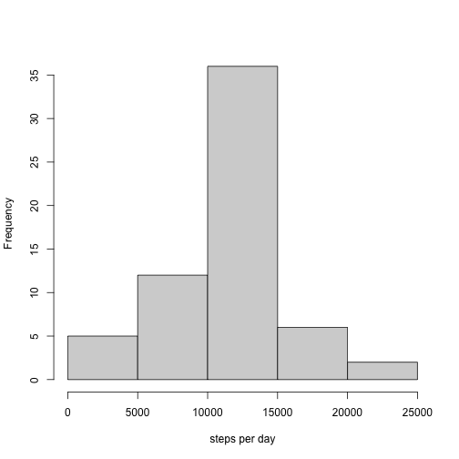

## Loading and preprocessing the data

```r
df <-  read.csv("activity.csv")
df$date <- as.Date(df$date, format="%Y-%m-%d")
summary(df)
```

```
##      steps             date               interval     
##  Min.   :  0.00   Min.   :2012-10-01   Min.   :   0.0  
##  1st Qu.:  0.00   1st Qu.:2012-10-16   1st Qu.: 588.8  
##  Median :  0.00   Median :2012-10-31   Median :1177.5  
##  Mean   : 37.38   Mean   :2012-10-31   Mean   :1177.5  
##  3rd Qu.: 12.00   3rd Qu.:2012-11-15   3rd Qu.:1766.2  
##  Max.   :806.00   Max.   :2012-11-30   Max.   :2355.0  
##  NA's   :2304
```

## What is mean total number of steps taken per day?

```r
library(dplyr)
x <- aggregate(df$steps, by=list(df$date), FUN=sum, na.rm=TRUE)
hist(x$x, xlab = "steps per day", main="")
```


```r
cat("mean =", round(mean(x$x), digits = 0), 
    "\nmedian =",  median(x$x))
```

```
## mean = 9354 
## median = 10395
```


## What is the average daily activity pattern?

```r
int <- aggregate(df$steps, by=list(df$interval), FUN=mean, na.rm=TRUE)
plot(x = int$Group.1, y = int$x, type = "l", xlab = "5-min intermals", ylab = "steps")
```


```r
cat("Max interval:", int[int$x==max(int$x),]$Group.1)
```

```
## Max interval: 835
```


## Imputing missing values

```r
sum(is.na(df))
```

```
## [1] 2304
```

```r
new_df <- df
# replace with interval average
for(i in 1:nrow(new_df)){
    if (is.na(new_df$steps[i]) == TRUE) {
      new_df[i,]$steps <- int[int$Group.1 == new_df[i,]$interval,]$x
    }}
# new hist
new_x <- aggregate(new_df$steps, by=list(new_df$date), FUN=sum, na.rm=TRUE)
hist(new_x$x, xlab = "steps per day", main="")
```



```r
cat("mean =", round(mean(new_x$x), digits = 0), 
    "\nmedian =",  median(new_x$x))
```

```
## mean = 10766 
## median = 10766.19
```

These values differ from the estimates from the first part of the assignment. Mean got higher and now equals the median. Median stayed the same.

## Are there differences in activity patterns between weekdays and weekends?

```r
library(timeDate)
new_df$day <- ifelse(isWeekday(new_df$date, wday=1:5), "weekday", "weekend")
new_df$day <- factor(new_df$day)

weekday_x <- aggregate(steps ~ interval, data=new_df[new_df$day=="weekday",], FUN=mean)
weekend_x <- aggregate(steps ~ interval, data=new_df[new_df$day=="weekend",], FUN=mean)
par(mfrow=c(2,1))
plot(x = weekday_x$interval, y = weekday_x$steps, type = "l", xlab = "5-min intermals", ylab = "steps", main="weekday")
plot(x = weekend_x$interval, y = weekend_x$steps, type = "l", xlab = "5-min intermals", ylab = "steps", main="weekend")
```


